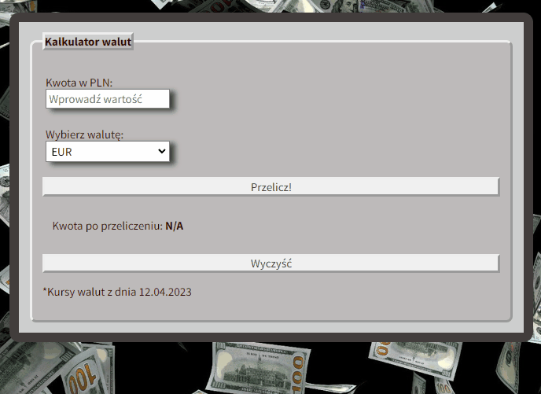

# Currency-calculator
This is a simple aplication to convert the currency into another.

## DEMO
https://enatalias.github.io/Currency-calculator/

## Prezentation and description
In the upper window, enter the amount in Polish zloty. Then select the currency and click the button "Przelicz!". 
Below afer accounting you will get in the currency amount. If you want to enter a different amount, you can delete it by clicking on the button "Wyczyść".

## Used Technologies:
- HTML
- CSS
- JavaScript
